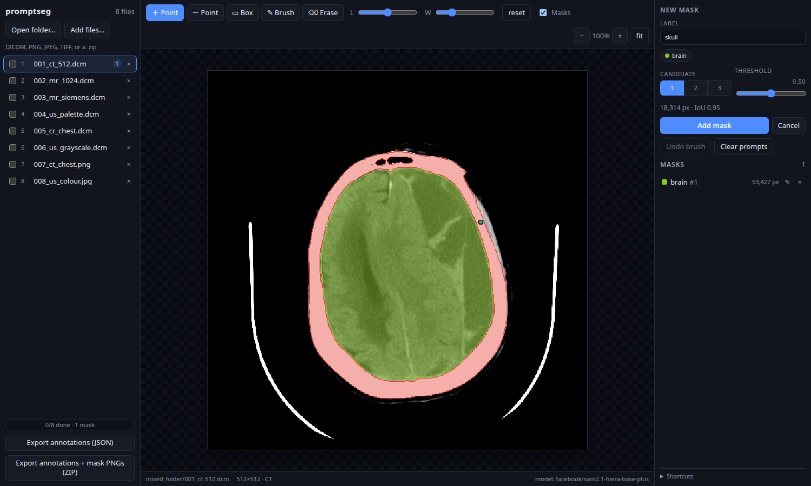

# promptseg

**Click a thing, get a labelled mask.** A browser tool for segmenting a whole
folder of images with SAM 2.1 — ordinary PNG, JPEG and TIFF, and DICOM with
proper window/level, side by side in one file list, one JSON export for the lot.



## Quick start

```bash
uv venv --python 3.12
uv pip install torch torchvision --torch-backend=cu128
uv pip install -r backend/requirements.txt
.venv/bin/python scripts/make_samples.py          # a folder to try it on

cd backend && ../.venv/bin/python -m uvicorn app:app --port 8000
```

Open <http://localhost:8000>, press **Open folder…**, pick `samples/mixed_folder`.
The first start downloads ~310 MB of weights; add `SAM2_STUB=1` to skip the model
entirely and just look around. Node is not needed — the frontend ships built.

## What it does

- **A folder at a time.** Pick a directory; every file becomes a row in the list
  with its own geometry, so a 64² thumbnail and a 16-megapixel photo can sit in
  one batch.
- **Labelled instances.** One label, many instances (`vertebra #1`, `#2`, …),
  and a label keeps its colour across every file in the folder.
- **Masks stay editable.** Refine the prompts, or paint with a brush — strokes
  are replayed on top of the model output, so hand corrections survive
  re-prompting.
- **One export for everything.** JSON for the whole workspace, optionally with a
  PNG per mask. Prompts and strokes are included, so an annotation is
  reproducible, not just readable.
- **DICOM is first-class, not converted.** Window and level are live controls
  and the model is fed exactly the windowed frame you are looking at; palette,
  MONOCHROME1 and multi-frame files all decode natively. Everything else loads
  as-is and simply hides the sliders.
- **~14 ms per click** on a 4090 at 512², because image embeddings are cached
  and only the prompt decoder re-runs. Bigger images cost more to paint than to
  think about: a 16 MP photo is ~250 ms, nearly all of it rendering the mask.

## Docs

| | |
| --- | --- |
| [Setup](docs/setup.md) | Requirements, install, Docker, sample images, configuration, troubleshooting |
| [Usage](docs/usage.md) | A five-minute walkthrough, loading, labelling, adjusting, exporting, shortcuts |
| [Architecture](docs/architecture.md) | How the encoder/decoder split works, the rules worth not breaking, layout, tests |
| [API & export](docs/api.md) | Endpoints and the export schema |

State is in memory only — export before stopping the server. Single user, no
auth, 2D only; see [Known limits](docs/architecture.md#known-limits).
